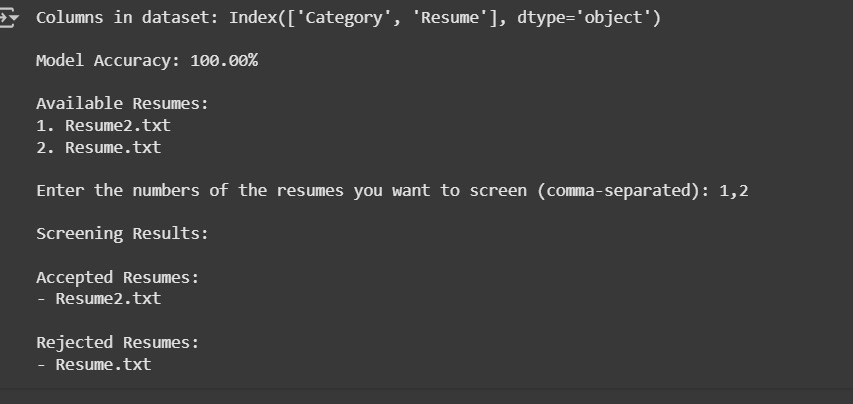

# Resume Screening Tool (Data Science Focus)

This project is a machine learning-powered resume screening tool designed to automatically identify resumes that are relevant to Data Science roles. It uses natural language processing (NLP) techniques with spaCy and TF-IDF vectorization, combined with a Random Forest classifier.

---

## 💡 Features

- Preprocesses resumes by lemmatizing and removing stopwords/punctuation.
- Converts resume text into TF-IDF vectors.
- Classifies resumes into **Data Science (Accepted)** or **Other (Rejected)**.
- Screens multiple `.txt` resumes from a specified directory.
- Displays clear results for each screened resume.

---

## ⚙️ Requirements

- Python 3.x
- Required Python Libraries:
  - `pandas`
  - `scikit-learn`
  - `spaCy`

Install the spaCy English model using:
---
## 📸 Output Example

---
